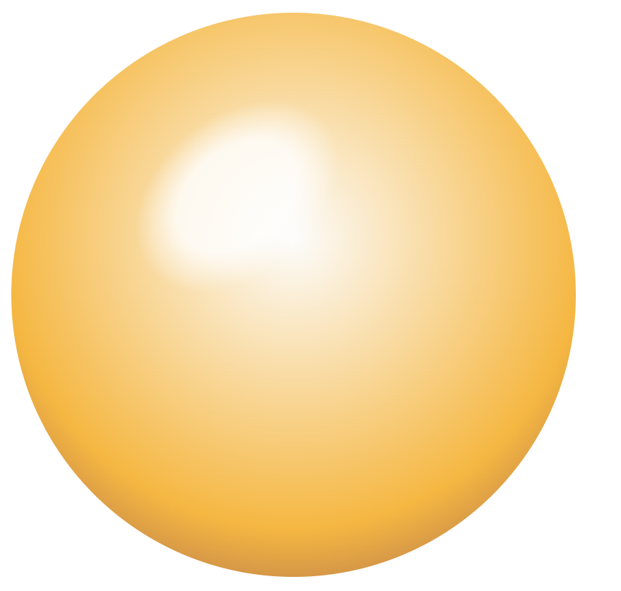

# @ditus/sphere-3d

[](LICENSE.md)
[](https://github.com/ditus-software/sphere-3d/actions/workflows/node.js.yml)
[](https://coveralls.io/github/ditus-software/sphere-3d?branch=master)
[](CODE-OF-CONDUCT.md)

This repo contains a UI components for React that displays a badge representing
a single nutrition fact, such as the fat or protein content of food. This repo
is open source and will remain so.



## Installation

```bash
npm i @ditus/sphere-3d
```

## Usage

Ensure that the parent container has dimensions specified or has a position of
relative since the sphere will take up the entire height and width of that
container.

```html
  <div
    style={{
      width: '400px',
      height: '400px',
    }}
  >
    <Sphere3D {...args} />
  </div>
```

## Demo

To view the components, type:

```bash
npm i
npm run storybook
```

## Roadmap

See the [open
issues](https://github.com/ditus-software/sphere-3d/issues) for a
list of proposed features (and known issues).

## License

This project is licensed under the terms of the [MIT license](LICENSE).
